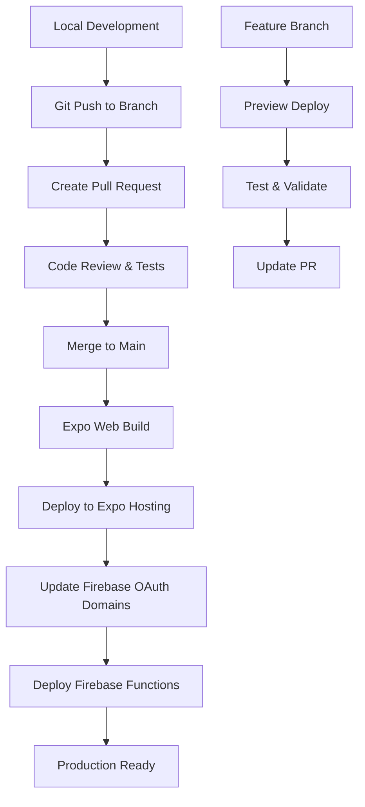

# Deployment Pipeline Guide

## 🚀 Overview

This document outlines the complete deployment pipeline for the Nerd Wordle app, including web builds, Firebase Functions, and domain management across different environments.

## 🏗️ Architecture Overview



## 🛠️ Tech Stack & Services

### Frontend Deployment

- **Platform**: Expo (React Native Web)
- **Hosting**: Expo Hosting
- **Build Tool**: EAS Build
- **Domain**: Generated Expo URLs (e.g., `https://nerd-wordle--xyz123.expo.app/`)

### Word Dictionary Deployment (CDN-First)

- **CDN**: Firebase Hosting (`https://nerd-word-cfda3.web.app/dict/`)
- **Versioning**: Auto-incrementing versions (v1, v2, v3...)
- **Cache Strategy**: Aggressive browser cache with URL versioning
- **Bundle Optimization**: Words excluded from app bundle (243KB saved)
- **Update Strategy**: Instant updates via CDN without app redeployment

### Backend Deployment

- **Platform**: Firebase Functions (Node.js)
- **Database**: Firestore
- **Authentication**: Firebase Auth with Google OAuth
- **Storage**: Firebase Storage (future)

### Development Tools

- **Package Manager**: pnpm
- **Version Control**: Git (GitHub)
- **CI/CD**: Manual deployment (GitHub Actions future)

## 📝 Environment Configuration

### Development Environment

```bash
# Local development server
pnpm expo start --web

# Local Firebase Functions
cd functions
pnpm run emulator:start
```

### Staging/Preview Environment

- **Trigger**: Pull Request creation
- **URL**: Auto-generated Expo preview URL
- **Purpose**: Testing features before merge

### Production Environment

- **Trigger**: Manual deployment from main branch
- **URL**: Stable Expo production URL
- **Purpose**: Live app for users

## 🚀 Deployment Workflows

### 1. Frontend Deployment (Expo Web)

#### Step-by-Step Process

**1. Prepare for Deployment:**

```bash
# Ensure you're on the correct branch
git checkout main
git pull origin main

# Install dependencies
pnpm install

# Test build locally (optional)
pnpm run web
```

**2. Deploy Web App:**

```bash
# Deploy web app to production
pnpm run deploy:web

# This will:
# - Export the web build with optimizations
# - Deploy to EAS hosting automatically
# - Provide the deployment URL
```

**3. Get the New URL:**
After deployment, Expo will provide a new URL like:

```
https://nerd-wordle--abc123def.expo.app/
```

**4. Update OAuth Domains (Critical!):**
Every new Expo deployment gets a unique URL, so you must update Firebase OAuth settings:

1. Go to [Google Cloud Console](https://console.cloud.google.com/apis/credentials)
2. Select your OAuth 2.0 client ID
3. Add the new Expo URL to "Authorized JavaScript origins"
4. Save changes

**5. Test the Deployment:**

- Visit the new URL
- Test Google Sign-In functionality
- Verify word loading and caching
- Check console for any errors

#### Automated Deployment Script

The recommended deployment approach using the configured scripts:

```bash
#!/bin/bash
# deploy-all.sh

echo "🚀 Deploying Nerd Wordle App..."

# Deploy everything (backend + web)
echo "📦 Deploying backend and web..."
pnpm run deploy:all

echo "🌐 Deployment complete!"
echo "⚠️  IMPORTANT: Update OAuth domains in Firebase Console"
echo "📋 Add the new URL to authorized domains"
echo "🔗 https://console.firebase.google.com/project/nerd-word-cfda3/authentication/settings"
```

Or deploy individually:

```bash
# Deploy just the functions (from functions/ directory)
cd functions && pnpm run deploy:functions

# Deploy just the web app (from root)
pnpm run deploy:web

# Deploy everything (from root)
pnpm run deploy:all
```

### 2. Backend Deployment (Firebase Functions)

#### Step-by-Step Process

**1. Prepare Functions:**

```bash
# Navigate to functions directory
cd functions

# Install dependencies
pnpm install

# Build TypeScript
pnpm build
```

**2. Test Locally (Optional):**

```bash
# Start local Firebase emulator with seeded data
cd functions
pnpm run emulator:start

# Test endpoints
curl http://localhost:5001/nerd-word-cfda3/us-central1/api/words
```

**3. Deploy to Firebase:**

```bash
# Deploy backend functions from root directory
pnpm run deploy:all

# Or deploy functions only (from functions/ directory)
cd functions && pnpm run deploy:functions
```

**4. Verify Deployment:**

- Check Firebase Console for successful deployment
- Test API endpoints
- Monitor function logs for errors

#### Function Deployment Commands

```bash
# Deploy everything (backend + web) from root directory
pnpm run deploy:all

# Deploy functions only (from functions/ directory)
cd functions
pnpm run deploy:functions

# Deploy all Firebase services (functions + rules + indexes)
cd functions
pnpm run deploy:all

# Deploy specific Firebase services
cd functions
pnpm run deploy:rules
pnpm run deploy:indexes

# With specific project
firebase deploy --project nerd-word-cfda3 --only functions
```

### 3. Database Updates (Firestore)

#### Firestore Rules Deployment

```bash
# Deploy security rules
firebase deploy --only firestore:rules

# Deploy indexes
firebase deploy --only firestore:indexes
```

#### Data Migrations

```bash
# Import production data to emulator (from functions/ directory)
cd functions
pnpm run migrate:from-prod

# Or start emulator with production data seeded
cd functions
pnpm run dev:prod-data
```

## 🔄 Complete Deployment Checklist

### Pre-Deployment

- [ ] Code reviewed and tested locally
- [ ] All tests passing
- [ ] Dependencies updated (`pnpm install`)
- [ ] Environment variables configured

### Frontend Deployment

- [ ] Run `pnpm run deploy:web`
- [ ] Note the deployment URL from output
- [ ] Update Firebase authorized domains
- [ ] Test Google Sign-In on new URL
- [ ] Verify app functionality

### Backend Deployment

- [ ] Build functions (`cd functions && pnpm build`)
- [ ] Deploy functions (`cd functions && pnpm run deploy:functions`)
- [ ] Check Firebase Console for success
- [ ] Test API endpoints
- [ ] Monitor function logs

### Post-Deployment

- [ ] Test end-to-end user flow
- [ ] Check error monitoring
- [ ] Update documentation if needed
- [ ] Notify team of deployment

## 🚨 Common Issues & Troubleshooting

### OAuth Domain Issues

**Problem**: "unauthorized domain" error after deployment

**Solution**:

1. Check the exact URL in browser
2. Go to Google Cloud Console
3. Add URL to authorized JavaScript origins
4. Wait 5-10 minutes for propagation
5. Test again

**Prevention**: Create a deployment script that reminds you to update domains

### Function Deployment Failures

**Problem**: Functions fail to deploy

**Common Causes**:

- TypeScript compilation errors
- Missing dependencies
- Incorrect Firebase project
- Insufficient permissions

**Solution**:

```bash
# Check build errors
cd functions
pnpm build

# Check Firebase project
firebase projects:list
firebase use nerd-word-cfda3

# Check permissions
firebase login
```

### Cache Issues After Deployment

**Problem**: Old cached data causing issues

**Solution**:

```bash
# Clear AsyncStorage in browser console (React Native Debugger)
# Or for web, clear the metadata key:
localStorage.removeItem("words_metadata_v3");

# Or clear all storage
localStorage.clear();

# Force refresh words on next app load
# Set the clear storage flag in dev environment
# See utils/dev-flags.ts shouldClearStorageOnStart()
```

### Build Size Issues

**Problem**: Expo build fails due to size limits

**Solution**:

- Optimize bundle size
- Remove unused dependencies
- Use dynamic imports for large libraries

## 📊 Monitoring & Analytics

### Deployment Monitoring

**Expo Deployment Status**:

- Check Expo dashboard for build status
- Monitor app load times
- Track deployment history

**Firebase Functions Monitoring**:

- Functions logs: https://console.firebase.google.com/project/nerd-word-cfda3/functions/logs
- Performance monitoring
- Error tracking

### Key Metrics to Watch

**Performance Metrics**:

- App load time
- API response times
- Cache hit rates
- Firestore read counts

**Error Metrics**:

- JavaScript errors in console
- Function execution errors
- Authentication failures
- Network request failures

## 🔮 Future Improvements

### Automated CI/CD Pipeline

**GitHub Actions Workflow**:

```yaml
# .github/workflows/deploy.yml
name: Deploy to Production

on:
  push:
    branches: [main]

jobs:
  deploy-web:
    runs-on: ubuntu-latest
    steps:
      - uses: actions/checkout@v3
      - name: Setup Node.js
        uses: actions/setup-node@v3
        with:
          node-version: "18"
      - name: Install dependencies
        run: pnpm install
      - name: Deploy to Expo
        run: pnpm expo export --platform web
        env:
          EXPO_TOKEN: ${{ secrets.EXPO_TOKEN }}

  deploy-functions:
    runs-on: ubuntu-latest
    steps:
      - uses: actions/checkout@v3
      - name: Deploy to Firebase
        uses: FirebaseExtended/action-hosting-deploy@v0
        with:
          repoToken: "${{ secrets.GITHUB_TOKEN }}"
          firebaseServiceAccount: "${{ secrets.FIREBASE_SERVICE_ACCOUNT }}"
          projectId: nerd-word-cfda3
```

### Domain Management Automation

**OAuth Domain Auto-Update**:

- Use Google Cloud API to automatically add new domains
- Parse Expo deployment output for new URLs
- Integrate with deployment script

### Environment Management

**Multi-Environment Setup**:

- Development: Local + Firebase emulator
- Staging: Preview Expo + staging Firebase project
- Production: Production Expo + production Firebase project

## 📚 Related Documentation

- [OAuth Domain Management](./oauth-domain-management.md)
- [Firestore Optimization](./firestore-optimization.md)
- [Testing Cache Optimization](./testing-cache-optimization.md)
- [Development Guide](./development-guide.md)

## 🆘 Emergency Procedures

### Rollback Deployment

**Frontend Rollback**:

- Expo doesn't support direct rollback
- Redeploy previous version from git
- Update OAuth domains if needed

**Backend Rollback**:

```bash
# Firebase Functions support version rollback
firebase functions:log
firebase deploy --only functions # (deploy previous version)
```

### Emergency Contacts

- **Firebase Issues**: Check Firebase Status Page
- **Expo Issues**: Check Expo Status Page
- **OAuth Issues**: Google Cloud Console support

---

_Keep this document updated as the deployment process evolves!_
