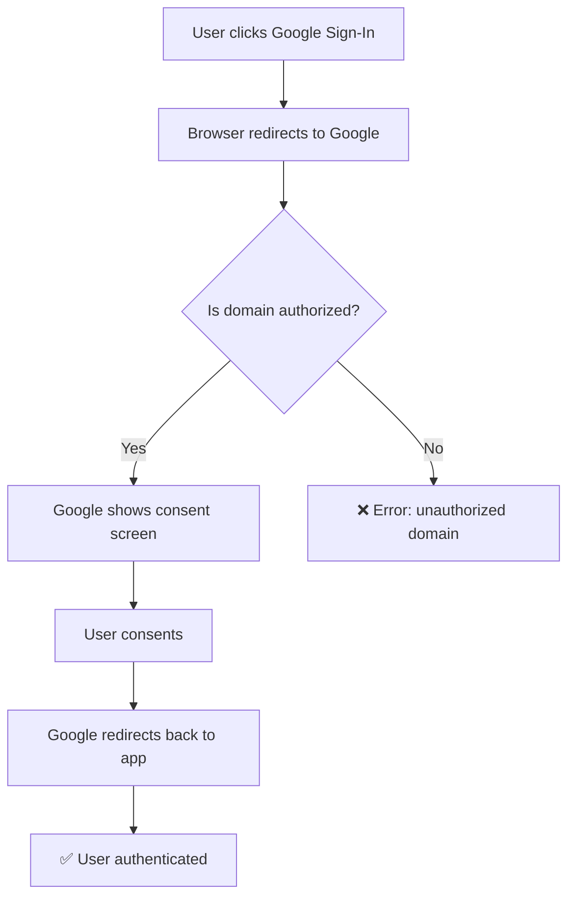
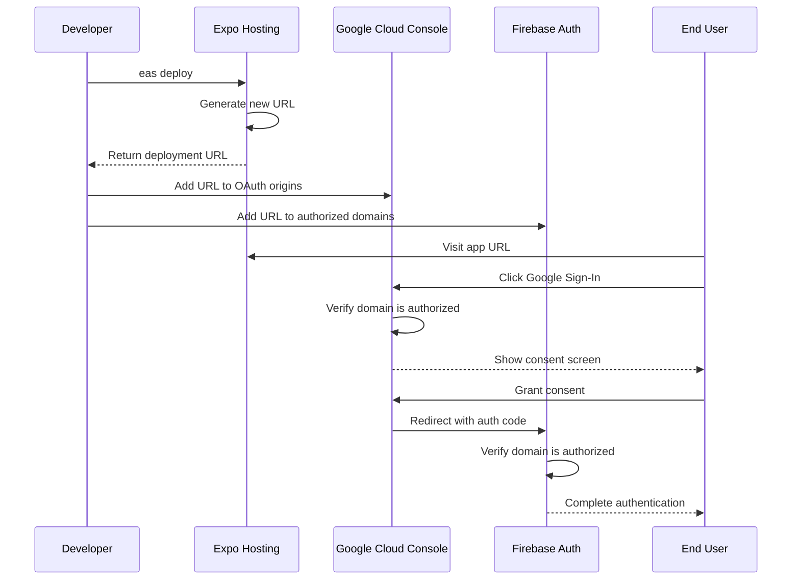

# Expo Deployment & OAuth Domain Management

## 🎯 The Problem: OAuth Domain Authorization for Expo Deployments

### What Happens When You Deploy a New Version

When you deploy an Expo web app, **each deployment gets a unique URL**:

- **Deployment 1**: `https://nerd-wordle--dz6aj1wgbl.expo.app`
- **Deployment 2**: `https://nerd-wordle--gckboxhf9k.expo.app`
- **Deployment 3**: `https://nerd-wordle--xyz123abc.expo.app`

### The OAuth Problem

Google OAuth (and Firebase Auth) require **pre-authorized domains** for security. When you deploy to a new URL:

❌ **New domain is not authorized** → Google Sign-In fails  
❌ **Error**: "unauthorized domain" or "redirect_uri_mismatch"  
❌ **Users can't authenticate** until domains are updated

### Why This Happens



**Security by Design**: Google validates redirect URLs to prevent OAuth hijacking attacks.

## 🔧 The Solution: Multi-Platform Domain Management

### Platform Overview

Our app uses **three platforms** that need domain authorization:

| Platform                    | Purpose                         | Domain Management             |
| --------------------------- | ------------------------------- | ----------------------------- |
| **Google Cloud Console**    | OAuth client configuration      | Authorized JavaScript origins |
| **Firebase Authentication** | Firebase Auth domain validation | Authorized domains            |
| **Expo Hosting**            | Web app deployment              | Dynamic URLs per deployment   |

### Step-by-Step Domain Update Process

#### 1. **Firebase Authentication Configuration (Primary)**

**Location**: https://console.firebase.google.com/project/nerd-word-cfda3/authentication/settings  
**Navigate to**: Authentication → Settings → Authorized domains

**Add domains (without https://):**

```
nerd-wordle--dz6aj1wgbl.expo.app    // Old deployment
nerd-wordle--gckboxhf9k.expo.app    // New deployment
localhost                           // Development
```

#### 2. **Google Cloud Console OAuth Configuration (If Needed)**

**Location**: https://console.cloud.google.com/apis/credentials  
**Navigate to**: APIs & Services → Credentials → OAuth 2.0 Client IDs

**Update "Authorized JavaScript origins":**

```
https://nerd-wordle--dz6aj1wgbl.expo.app    // Old deployment
https://nerd-wordle--gckboxhf9k.expo.app    // New deployment
https://localhost:8081                       // Development
https://localhost:19006                      // Expo web dev
```

**Keep "Authorized redirect URIs" as:**

```
https://auth.expo.io/@dilloncleaver/nerd-wordle
http://localhost:8081
https://nerd-wordle--dz6aj1wgbl.expo.app/
https://nerd-wordle--gckboxhf9k.expo.app/
```

#### 3. **Verify Configuration**

**Test each deployment:**

- Old URL: https://nerd-wordle--dz6aj1wgbl.expo.app
- New URL: https://nerd-wordle--gckboxhf9k.expo.app

**Expected behavior:**

- ✅ Google Sign-In button appears
- ✅ Click opens Google consent screen
- ✅ After consent, user is authenticated
- ✅ No "unauthorized domain" errors

## 🚀 Deployment Workflow Best Practices

### Current Deployment Commands (Expo Best Practices 2025)

```bash
# Build and deploy using EAS (recommended)
eas build --platform web

# This automatically deploys and provides the new URL
```

### The URL Problem

**Issue**: Each `eas build --platform web` creates a new random URL  
**Impact**: Breaks OAuth until domains are manually updated  
**Solution**: Use consistent URLs with aliases (when available)

### Recommended Approach: Stable URLs

#### Option 1: Use Production Aliases

```bash
# Deploy to consistent production URL
eas deploy --prod
```

#### Option 2: Custom Domain (Future)

```bash
# Configure custom domain (requires EAS subscription)
# Example: https://nerd-wordle.com
```

#### Option 3: Automation Script

Create a deployment script that auto-updates OAuth domains:

```typescript
// scripts/deploy-with-oauth-update.ts
import { execSync } from "child_process";

async function deployWithOAuthUpdate() {
  // 1. Deploy to Expo using EAS
  const deployment = execSync("eas build --platform web", { encoding: "utf8" });

  // 2. Extract new URL from deployment output
  const urlMatch = deployment.match(
    /https:\/\/nerd-wordle--[a-z0-9]+\.expo\.app/
  );
  const newUrl = urlMatch?.[0];

  if (newUrl) {
    console.log(`🔄 Updating OAuth domains for: ${newUrl}`);

    // 3. Update Firebase Auth authorized domains
    // 4. Update Google Cloud Console (if needed)
    // 5. Verify configuration

    console.log("✅ OAuth domains updated successfully");
  }
}
```

## 📊 System Architecture: OAuth Domain Flow



## 🔍 Troubleshooting Common Issues

### Error: "unauthorized domain"

**Symptoms:**

- Google Sign-In fails immediately
- Console shows "unauthorized domain" error
- User never sees Google consent screen

**Root Cause:**

- New deployment URL not in Google Cloud Console OAuth origins

**Solution:**

1. Get current deployment URL from `eas deploy` output
2. Add to Google Cloud Console → OAuth client → Authorized JavaScript origins
3. Wait 5-10 minutes for changes to propagate

### Error: "redirect_uri_mismatch"

**Symptoms:**

- User sees Google consent screen
- After consent, gets redirect error
- Error mentions "redirect_uri_mismatch"

**Root Cause:**

- Redirect URI not properly configured
- Usually an issue with trailing slashes or protocols

**Solution:**

1. Check exact redirect URI in error message
2. Add exact URI to Google Cloud Console redirect URIs
3. Ensure Firebase has domain in authorized domains

### Firebase Auth Error

**Symptoms:**

- Google OAuth succeeds
- Firebase authentication fails
- Console shows Firebase auth errors

**Root Cause:**

- Domain not in Firebase Authentication authorized domains

**Solution:**

1. Go to Firebase Console → Authentication → Settings
2. Add domain to "Authorized domains" (without https://)
3. Save changes

## 📝 Manual Update Checklist

### When Deploying New Version:

- [ ] **Deploy app**: `eas build --platform web`
- [ ] **Note new URL**: Copy from EAS build output
- [ ] **Update Firebase Auth**: Add to Authorized domains (primary)
- [ ] **Update GCP OAuth**: Add to Authorized JavaScript origins (if needed)
- [ ] **Test authentication**: Verify Google Sign-In works
- [ ] **Update documentation**: Record new URL for team

### Verification Steps:

- [ ] **Load app**: Visit new deployment URL
- [ ] **Check console**: No JavaScript errors
- [ ] **Test sign-in**: Click Google Sign-In button
- [ ] **Complete flow**: Sign in with Google account
- [ ] **Verify user**: Check that user appears authenticated
- [ ] **Test features**: Ensure protected features work

## 🎯 Future Improvements

### 1. **Stable URLs with Aliases**

```bash
# Use consistent production alias
eas deploy --alias production  # Always same URL
```

### 2. **Custom Domain Setup**

```bash
# Configure custom domain (EAS subscription required)
# Benefits: Stable URL, better branding, easier OAuth management
```

### 3. **Automated OAuth Management**

```typescript
// Auto-update OAuth domains after deployment
// Integrate with Google Cloud API and Firebase Admin SDK
```

### 4. **CI/CD Integration**

```yaml
# GitHub Actions workflow
- name: Deploy and Update OAuth
  run: |
    eas deploy
    npm run update-oauth-domains
```

## 💡 Key Takeaways

### For System Design Discussions:

1. **Security First**: OAuth domain validation prevents attacks
2. **Trade-offs**: Security vs. deployment convenience
3. **Automation**: Manual processes don't scale
4. **Monitoring**: Track OAuth failures in production
5. **Documentation**: Keep domain lists updated

### Technical Lessons:

- ✅ **Always test authentication after deployment**
- ✅ **Maintain list of authorized domains**
- ✅ **Consider stable URLs for production**
- ✅ **Plan for automated domain management**
- ✅ **Monitor OAuth error rates**

---

_This process highlights the importance of considering authentication flows in deployment pipelines and the security trade-offs in modern web applications._
